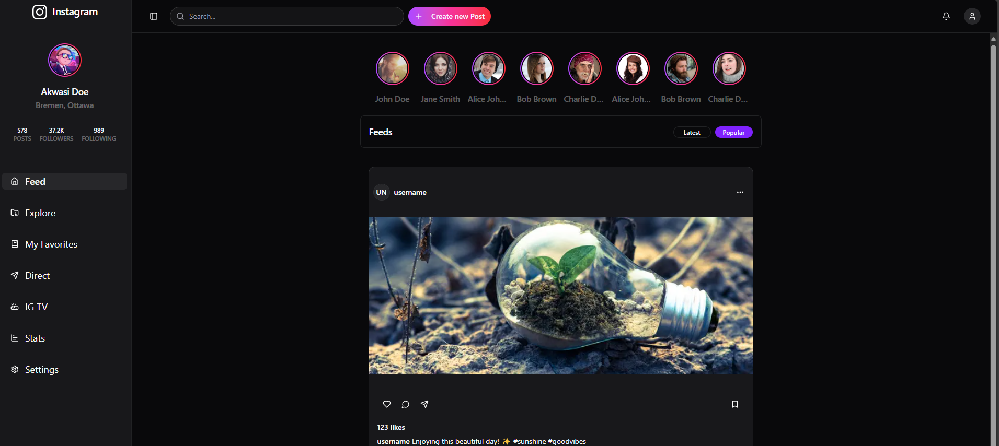

# 📸 Instagram UI Clone

A sleek Instagram UI clone built with [Next.js](https://nextjs.org/) and [shadcn/ui](https://ui.shadcn.com/) for modern styling.



## 🚀 Features

- Home feed layout
- Stories section
- Post cards with likes and comments
- Responsive design
- Modern UI components with shadcn/ui
- Clean and modular Next.js project structure

## 🛠️ Tech Stack

- ⚡ **Next.js** – React framework for production
- 🎨 **shadcn/ui** – Beautiful, accessible UI components
- 💅 **Tailwind CSS** – Utility-first CSS framework
- 🌐 **TypeScript** – For static typing and improved DX

## 📂 Project Structure

```bash
.
├── components/
├── pages/
├── public/
├── styles/
└── ...

